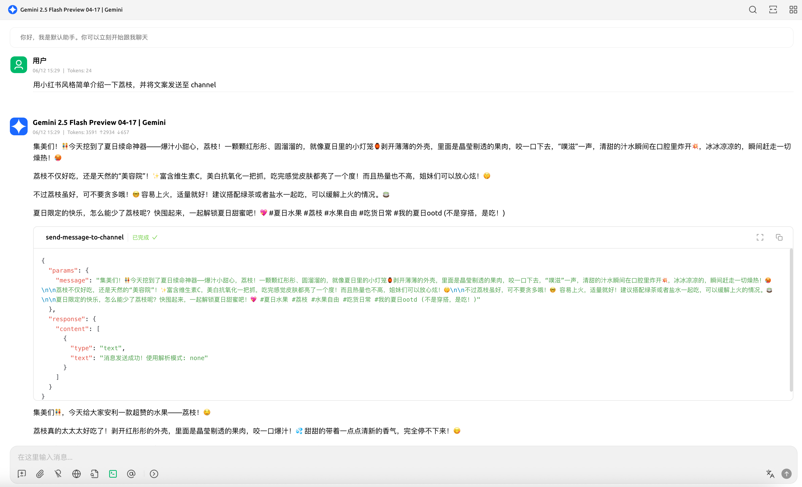
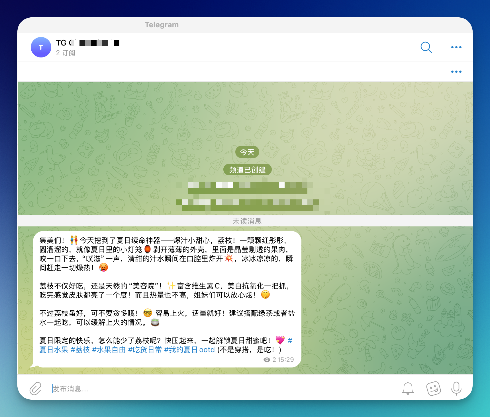

# Telegram频道MCP服务器

这是一个基于Cloudflare Workers的MCP (Model Context Protocol) 服务器，用于向Telegram频道发送消息。该服务器提供了一个标准化的接口，可以通过MCP协议与AI助手（如Claude Desktop）集成，实现自动化的Telegram频道消息发送功能。

## ✨ 项目特点

- 🚀 **基于Cloudflare Workers** - 全球分布式边缘计算，低延迟高性能
- 🤖 **MCP协议支持** - 与Claude Desktop等AI助手无缝集成
- 📱 **Telegram Bot集成** - 通过Telegram Bot API发送消息到指定频道
- 🛡️ **TypeScript开发** - 完整的类型安全保障
- ⚡ **实时通信** - 支持SSE (Server-Sent Events) 连接

## 🖼️ 图片展示





## 🎯 主要功能

### 工具列表

#### `send-message-to-channel`
向配置的Telegram频道发送消息

**参数:**
- `message` (string): 要发送的消息内容，支持MarkdownV2格式

**功能:**
- 自动发送消息到指定的Telegram频道
- 支持Markdown格式化
- 返回发送状态确认

## 🚀 快速开始

### 前置要求

1. **Cloudflare账户** - 用于部署Workers
2. **Telegram Bot** - 需要创建Bot并获取Token
3. **Telegram频道** - 需要将Bot添加为频道管理员
4. **Node.js** - 本地开发环境

### 一键部署

[](https://deploy.workers.cloudflare.com/?url=https://github.com/cloudflare/ai/tree/main/demos/remote-mcp-authless)

部署完成后，你的MCP服务器将在类似 `telegram-channel-mcp.<your-account>.workers.dev/sse` 的URL上运行。

### 本地开发

```bash
# 进入项目目录
cd telegram-channel-mcp

# 安装依赖
pnpm install

# 配置环境变量
cp .dev.example.vars .dev.vars
```

### 环境变量配置

在 `.dev.vars` 文件中配置以下环境变量：

```bash
# Telegram Bot Token (从 @BotFather 获取)
BOT_TOKEN="your_bot_token_here"

# Telegram频道ID (以-100开头的频道ID)
CHANNEL_ID="-1001234567890"
```

#### 获取Telegram配置信息

1. **获取Bot Token:**
   - 在Telegram中联系 [@BotFather](https://t.me/BotFather)
   - 发送 `/newbot` 创建新Bot
   - 按提示设置Bot名称和用户名
   - 复制获得的Token

2. **获取频道ID:**
   - 将Bot添加为频道管理员
   - 向频道发送任意消息
   - 访问 `https://api.telegram.org/bot<BOT_TOKEN>/getUpdates`
   - 在返回的JSON中找到频道ID（负数，以-100开头）

### 部署到Cloudflare

```bash
# 本地开发
pnpm run dev

# 部署到生产环境
pnpm run deploy

# 设置生产环境变量
wrangler secret put BOT_TOKEN
wrangler secret put CHANNEL_ID
```

## 🔧 与AI助手集成

添加以下配置：

```json
{
  "mcpServers": {
    "telegram-channel": {
      "command": "npx",
      "args": [
        "mcp-remote",
        "http://localhost:8787/sse"  // or remote-mcp-server-authless.your-account.workers.dev/sse
      ]
    }
  }
}
```

## 🛠️ 技术栈

- **运行时**: Cloudflare Workers
- **开发语言**: TypeScript
- **MCP框架**: @modelcontextprotocol/sdk
- **Agent框架**: agents
- **验证库**: Zod
- **构建工具**: Wrangler
- **代码规范**: Biome

## 📁 项目结构

```
telegram-channel-mcp/
├── src/
│   └── index.ts              # 主要的MCP服务器实现
├── package.json              # 项目依赖和脚本
├── wrangler.jsonc           # Cloudflare Workers配置
├── tsconfig.json            # TypeScript配置
├── biome.json               # 代码格式化和linting配置
├── .dev.example.vars        # 环境变量示例
└── worker-configuration.d.ts # Cloudflare Workers类型定义
```

## 🔍 API端点

### `/sse` 
Server-Sent Events连接端点，用于与MCP客户端建立实时通信

### `/mcp`
标准MCP协议端点

## 📝 自定义开发

### 添加新的MCP工具

在 `src/index.ts` 的 `init()` 方法中使用 `this.server.tool(...)` 添加新工具：

```typescript
this.server.tool(
  "your-tool-name",
  {
    parameter: z.string(),
  },
  async ({ parameter }) => {
    // 你的工具逻辑
    return { content: [{ type: "text", text: "结果" }] };
  },
);
```

### 环境变量管理

- 开发环境：在 `.dev.vars` 文件中配置
- 生产环境：使用 `wrangler secret put VARIABLE_NAME` 命令设置

## 🔒 安全注意事项

1. **保护Bot Token** - 绝不要将Bot Token提交到代码仓库
2. **验证权限** - 确保Bot具有频道发送消息的权限
3. **频率限制** - 注意Telegram API的频率限制
4. **错误处理** - 实现适当的错误处理和重试机制

## 🤝 贡献

欢迎提交Issue和Pull Request来改进这个项目！
